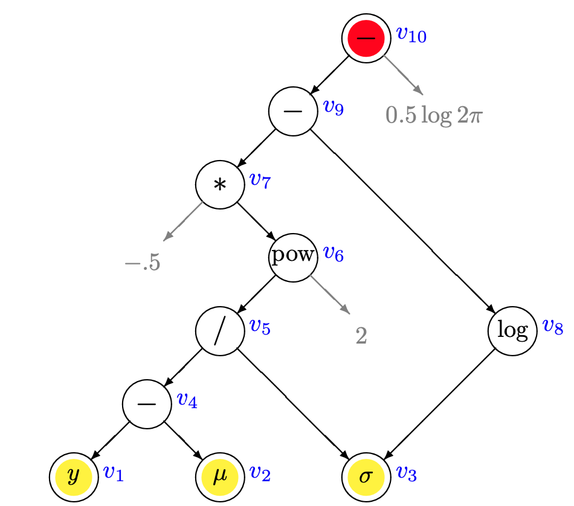

```{r, setup, include=FALSE}
knitr::opts_chunk$set(collapse = TRUE, comment = "")
```

### Content[^1]
[^1]: The slides are generated by markdown using the file named as
    _into_to_stan.Rmd_ in the directory:
    https://github.com/beyondpie/intro_to_stan.

An introduction to STAN, a well-designed and easily used tool, for statistical
modeling. 

* What is STAN.

* How STAN works.

* How to write a STAN script.

* How to run it and analyze the result.

# Introduction

### What is STAN [^2]
[^2]: https://mc-stan.org

* A _programming language_
   + It supports array data structure, while loops, and conditionals. 
   + The syntax much like C++. But no need to worry about C++.
   + STAN itself is written in C++.
   + A model written in STAN needs to be compiled.

* Specifically designed for the _statistical modeling_
   + Vector, matrix and their operations
   + A series of probabilistic functions
   + A series of blocks to describe a statistical model.
   + Support sampling, maximum likelihood estimation and variational inference. 
   
### A typical STAN script: modules
```{r eval = FALSE}
## optional
functions {} ## declarations and definitions
## critical module
data {}  ## declarations, NO STATEMENTS, READ FROM EXTERNAL.
## optional
transformed data {} ## declarations, statements
## critical module
parameters {} ## declareations, NO STATEMENTS
## optioanl
transformed parameters {} ## declarations, statements
## critical module
## STAN will make what you write here into
## the log joint density function
## may lack of the constant
model {} ## declarations, statements
## optional
generated quantities {} ## declarations, statements
```

# Behind STAN

### MCMC Sampling in STAN

* _Hamiltonian Monte Carlo (HMC)_ provides a general sampling procedure for
  Bayesian inference: using the derivatives of the density function.
  
* HMC and its adaptive variant the no-U-turn sampler (NUTS) [@hoffman2014no] are
used in STAN. NUTS is the default one.

* You DON'T need to write the derivatives in STAN.

### HMC in STAN

* Sampling goal: $p(\theta | y)$, the posterior distribution given data $y$.
  
* HMC introduces auxiliary momentum variables $\rho$. $p(\rho, \theta) = p(\rho
  | \theta) p(\theta)$. In STAN, $p(\rho|\theta) \sim \mathcal{N}(0, M)$, is independent of $\theta$

* Parameters in HMC [See Chapter 15 in STAN Reference Manual]
  + The discretization time $\epsilon$ [^3] will be automatically optimized during
    warmup to match an acceptance rate parameter $\delta$ (default is 0.8).
    Increasing _$\delta$_ will force the
    sampler to use small step sizes, and increase the effective sample size per
    iteration.
  + The $M^{-1}$ (default a diagonal matrix) is estimated during warmup[^4].
  + Number of steps taken $L$ is dynamically adapted during sampling (and during
    warmup) in NUTS, which is controlled by a predefined parameter _treedepth_.

<!-- * _treedepth_ is an important diagnostic tool for NUTS. -->

<!-- * Hamiltonian trajectory is recorded as another diagnostic way to access which -->
  <!-- iterations encountered divergences of the Hamiltonian from the its initial value. -->

[^3]: STAN also allows step-size jitter, which means "jittered" randomly during
      sampling to avoid poor interactions. Default is 0, producing no jitter.

[^4]: STAN supports _Euclidean HMC_. M could be configured by the user.
	 
### Bounded parameters transformation

Besides auto-tuning the parameters in HMC (NUTS), STAN will transform the
bounded variables to an unconstrained ones in the backend. 

The basis idea is to set a one-to-one transformation $y = f(x)$:
$$ p_Y(y) = p_X(f^{-1}(y)) |det J_{f^{-1}}(y)| $$

### Transformations: examples

* $y = \log(x - a)$ if $x$ has lower bound $a$.
* $y = logit(x) = \log \frac{x}{1-x}$ if $x \in (0, 1)$.
* $y = logit(\frac{x-a}{b -a})$ if $x \in (a, b)$.
* If $x$ is ordered, then $y_k = \log (x_k - x_{k-1})$.
* If $x_k >0, \sum_{k}^{K}x_k = 1$, then $y_k = logit(z_k) - log(\frac{1}{K-k});
  z_k = \frac{x_k}{1 - \sum_{s=1}^{k-1}x_s}, z \in \mathcal{R}^{K-1}$.
* When $x$ is a correlation matrix, find the upper triangular $w$ such that $x =
  w w^{T}$, which can be done Cholesky decomposion. Then an inverted
  transformation is designed on $w$ [See chapter 10 in STAN Referenc Manual for details].

### STAN Math Library
* STAN owns a mathematical library [@carpenter2015stan] named STAN Math Library
  that can automatically get the gradients (not the numerical approximation) and
  support matrix operations ,linear 
  algebra, most common probability functions and so on.
  
* It's a C++, reverse-mode automatic differentiation library. Not limited to
  STAN, and designed to be extensive, efficient, scalable and so on.

### Reverse-Mode Automatic Differentiation: an example

$f(y, \mu, \sigma) = -\frac{1}{2} (\frac{y-\mu}{\sigma})^2 - \log \sigma -
\frac{1}{2} \log 2 \pi$

```{r pressure, echo=FALSE, fig.cap="Expression graph of the normal log densityfunction (carpenter2015stan)", out.width = '60%'}

```
<!-- ![Expression graph of the normal log density function [@carpenter2015stan]](figures/autodiff.png) -->

### Posterior Analysis
* $\hat{R}$ statistic
  - An MCMC sample consists of a set of sequence of $M$ (default is 4 in STAN)
Markov samples, each consisting of an ordered sequence of $N$ draws from the posterior.
   - The $\hat{R}$ [@gelman1992inference] statistic measures the ratio of the average variance of samples
within each chain to the variance of the pooled samples across chains. Each chain is split into two halves before STAN calculates $\hat{R}$.
   - If all chains are at equilibrium, $\hat{R}$ will be one. In practice, STAN
suggests $\hat{R}$ should be below 1.1. 
* Effective sample size(ESS)
  - $N_{eff}$ is defined in terms of the autocorrelations within the sequence at
    different lags, $N_{eff} = \frac{N}{1 + 2\sum_t \rho_t}$. 
  - STAN estimates $N_{eff}$ with the autocorrelations (using FFT[@Geyer:2011])
    and $\hat{R}$ based on multiple chains.
* MCMC Standard Error: $\hat{\sigma_n}/\sqrt{N_{eff}}$.
  
# RUN STAN

### How to use STAN with R?
STAN development team provides [lots of choices](https://github.com/stan-dev)
for R users.

* __RStan__: the R interface to STAN. 
  - One can fit the model in R and access the output. It relies on Rcpp to call
    C++ code, and hard to keep updates with the newest STAN.
* __CmdStan__: command-line / shell interface.
  - One can control the compiling easily, e.g., add multi-thread support and GPU
    support. It directly uses the latest STAN, but not flexible.
* __CmdStanR__: a lightweight interface to CmdStan. You can control CmdStan without leaving R.
* __brms__[@burkner2016brms]: will make the STAN script for you and pass it to __RStan__.
* [rstanarm](https://mc-stan.org/rstanarm/articles/rstanarm.html)
  - Bayesian applied regression modeling (arm) via rstan. You can use the
    customary R modeling sytax, like _glm_ with a _formula_ and _data.frame_.
	
### Dependencies

* stan math lib <- stan <- rstan (pystan)
* stan math lib <- stan <- rstan <- rstanarm
* stan math lib <- stan <- cmdstan <- cmdstanr (cmdstanpy, matlabstan, ...)

### Let's consider a simple example. 

* Suppose we have $N$ binary observations $y_{1},
y_{2}, \ldots, y_{N}$. They are the _i.i.d_ samples from a $Bernoulli$
distribution under the parameter $\theta$. 

* Our goal is to infer $\theta$.

### Set up the STAN env in R.
```{r include = TRUE, warning = FALSE, message = FALSE}
library(cmdstanr)
# Note: the cmdstan home path is from my computer.
set_cmdstan_path(path = paste(Sys.getenv("HOME"),
                 "softwares",
                 "cmdstan-2.23.0", sep = "/"))
library(bayesplot)
library(posterior)

cmdstan_path()
cmdstan_version()
```
### STAN script

```{r include = TRUE, warning = FALSE, message = FALSE, cache = TRUE}
## bernoulli.stan is the file in the same directory.
bern_mod <- cmdstan_model("bernoulli.stan",
                          ## STAN need to be complied.
                          compile = TRUE)
## show the content in the stan script.
bern_mod$print()
```

### Let's feed it some data

```{r include = TRUE, results = 'hide'}
bern_data  <- list(N = 10, y = c(0,1,0,0,0,0,0,0,0,1))
## Run MCMC using the 'sample' method
bern_mcmc <- bern_mod$sample(data = bern_data,
                             seed = 355113,
                             chains = 4,
                             parallel_chains = 2,
                             show_message = FALSE)
```

### Posterior draws

```{r include=TRUE, collapse = TRUE}
draws <- bern_mcmc$draws()
str(draws)
## use posterior::as_draws_df to transorm the results
## into data.frame.
```
### Posterior draws
```{r include=TRUE, collapse = TRUE, fig.height = 3}
color_scheme_set("mix-blue-red")
bayesplot::mcmc_combo(draws,
                      pars = c("theta"), widths = c(1,3),
                      combo = c("dens_overlay", "trace"),
                       gg_theme = legend_none())
```

### Posterior draws
```{r include=TRUE, collapse = TRUE, fig.height = 3}
bayesplot::mcmc_acf(posterior::as_draws_df(draws), 
                      pars = "theta")
```

### STAN diagnosis{.allowframebreaks}
```{r include=TRUE, eval = FALSE}
## use `posterior` package
bern_mcmc$cmdstan_diagnose()

## Checking sampler transitions treedepth.
## Treedepth satisfactory for all transitions.

## Checking sampler transitions for divergences.
## No divergent transitions found.

## Checking E-BFMI - sampler transitions HMC potential energy.
## E-BFMI satisfactory for all transitions.

## Effective sample size satisfactory.

## Split R-hat values satisfactory all parameters.
## Processing complete, no problems detected.
```

### Summary of the sampling in STAN
```{r include=TRUE}
## use `posterior` package
bern_mcmc$summary("theta", "mean", "sd" , "rhat",
                  "ess_bulk")
```

### How about variational inference and MLE estimation

```{r include = TRUE, results = 'hide'}
bern_vb <- bern_mod$variational(data = bern_data,
                                  seed = 355113,
                                  output_samples = 4000)
```
```{r include = TRUE, results = 'hide'}
bern_mle <- bern_mod$optimize(data = bern_data,
                              seed = 355113)
```

### Result Summary

```{r echo = TRUE, results = 'hide', fig.height = 3, warning = FALSE, message = FALSE}
bayesplot_grid(
  mcmc_hist(bern_mcmc$draws("theta"), binwidth = 0.02) +
  vline_at(bern_mle$mle(), size = 1.2),
  mcmc_hist(bern_vb$draws("theta"), binwidth = 0.02) +
  vline_at(bern_mle$mle(), size = 1.2),
  titles = c("MCMC", "VI"),
  xlim = c(0,1))
```

# Materials and Summary

### STAN Materials

* [STAN Functions](https://mc-stan.org/docs/2_24/functions-reference/)
  - Use this as the reference materials. When you want some functions, just search it.
  
* [STAN Reference Manual](https://mc-stan.org/docs/2_24/reference-manual/index.html)
  - You can scan this if you want to know the whole picture of STAN syntax.
  
* [STAN User Guide](https://mc-stan.org/docs/2_24/stan-users-guide/index.html)
  - After the introduction, you could read this document smoothly.
  - Lots of examples cover different statistical modelings.
  - It could be a good material to learn statistical models.

* [STAN discourse](https://discourse.mc-stan.org)
  - Friendly and active!
 
### Summary
* STAN is designed as a statistical programming language. 
  - Rich of elements, such as matrix operations, probabilistic functions.
  - The clear structures of the modules/blocks for describing a model.
  - Efficiency: C++ backend, multi-thread support, GPU support and map-reduce support.
  
* STAN provides a general and solid inference framework.
  - Uses _NUTS_ and _HMC_ for sampling.
  - Uses _ADVI_[@kucukelbir2017automatic]  for variational inference.
  - Use _L-BFGS_ for optimization, such as MLE estimation.
  
* STAN has lots of APIs for R.

### Discussion

* STAN does not support sampling discrete parameters. The Rao-Blackwellized
estimators must be used: marginalizing out the discrete parameters [^5].

* Modern neural network tools, like tensorflow, pytorch: they also support the
  automatic differentiation, and what's more, they love GPU and eating different
  kinds of data. So recently, [pyro](https://pyro.ai) and other tools are
  developed for "deep" probabilistic programming.

[^5]:
    https://statmodeling.stat.columbia.edu/2020/01/29/rao-blackwellization-and-discrete-parameters-in-stan/


### Thanks!

* You can find this presentation at https://github.com/beyondpie/intro_to_stan,
  where you can follow the README file to reproduce the example.

* Any suggestions or Pull Requests are welcome.
